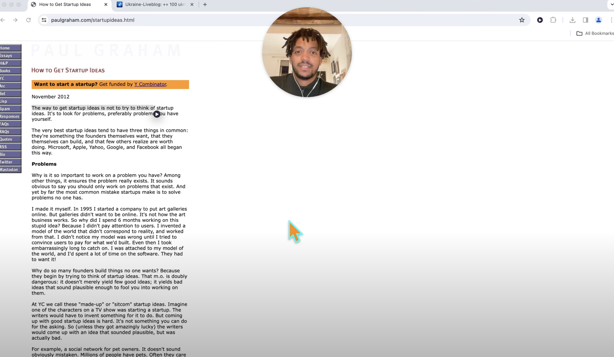

# Human Reader

A Chrome extension that lets you listen to any text on the web in a human voice. It supports two text-to-speech providers — **ElevenLabs** (elevenlabs.io) and **60db** (60db.ai) — and you can switch between them at any time. Any feedback or contributions are welcome!

The extension is available here: https://chromewebstore.google.com/detail/human-reader/klohmfhfijipahknljjelpfgjpmandmg

Check out the demo here:

## Usage

1. Click the extension icon to open the popup.
2. Use the **Provider** dropdown to choose **ElevenLabs** or **60db**.
3. Paste the API key for the selected provider and click **Set**:
   - ElevenLabs: copy your key from your [profile page](https://elevenlabs.io).
   - 60db: copy your key from [60db.ai](https://60db.ai) (see the [docs](https://docs.60db.ai)).
4. Pick a **Voice** (synced from your account), an optional **Model** (ElevenLabs only),
   and a playback **Speed**.
5. On any web page, select text and either click the floating play button, use the
   right-click **"Human Reader - Start reading"** menu, or press **Ctrl/Cmd + H**.

Each provider keeps its own API key, voice list, and selected voice, so switching back
and forth does not require re-entering anything. Speed is shared across both providers.

## Providers

| | ElevenLabs | 60db |
| --- | --- | --- |
| Auth | `xi-api-key` header | `Authorization: Bearer` header |
| TTS endpoint | `POST /v1/text-to-speech/{voiceId}/stream` (binary MP3 stream) | `POST /tts-stream` (NDJSON stream of base64 MP3 chunks) |
| Voices | `GET /v1/voices` | `GET /myvoices` |
| Key check | `GET /v1/user` | `GET /myvoices` |
| Model selector | Turbo v2 / Turbo v2.5 / Multilingual v2 | n/a (model is tied to the voice) |

Both providers feed the same in-page MediaSource player, so playback behaves the same
regardless of which one is active.

## **Changelog:**

### Version 1.7
New features:
- Added **60db** as a second text-to-speech provider alongside ElevenLabs
- Provider dropdown in the popup to switch between ElevenLabs and 60db (one active at a time)
- Per-provider storage of API keys, voice lists, and selected voice
- Keyboard shortcut (Ctrl/Cmd + H) to play/pause selected text

### Version 1.6 -  [PR](https://github.com/sebhs/human-reader-chrome-extension/pull/31)
New features: 
- Allowing users to stop audio from playing
- Adding support for Turbo v2.5

### Version 1.3 -  [PR](https://github.com/sebhs/human-reader-chrome-extension/pull/24)
New features: 
- Start reading text from context menu (helpful if play button doesn't show up). Implemented by @Protonosgit. Thank you :) 
- Add MIT license

### Version 1.2 - [PR](https://github.com/sebhs/human-reader-chrome-extension/pull/8)

New features:

- Auto-sync voice library - no need to click "Sync" anymore, it happens in the background
- Speed slider - set the playback speed from 0.5x to 2.5x
- Much lower latency - using the stream endpoint to improve performance and lower latency

### Version 1.1

New Features

- Improved onboarding experience, making it easier to get started
- Synchronization with Elevenlabs voice library

### Version 1.0

Initial release includes features:

- Select any text on the web and play audio using Elevenlabs API
- Set ID of a voice you want to use
- Select between fast mode (English only), or multilingual mode
